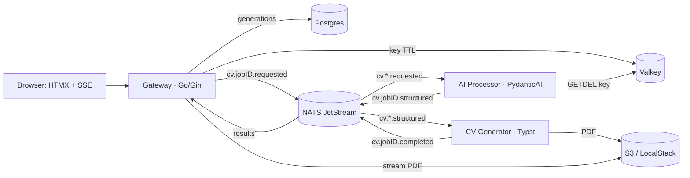

# cv

**An AI-powered, per-job-tailored CV generator — built as a platform-engineering showcase.**

You paste your experience and a target job description, bring your own LLM API key (or run the keyless demo provider), and get back a Typst-rendered PDF CV tailored to that role. The product works end-to-end as a single `docker compose up` vertical slice.

The *product* is the excuse. The point of this repo is the engineering **around** the product: clean service contracts, async event choreography, reproducible codegen, full observability, and path-filtered per-service CI — the things a platform engineer actually owns. v1 scope is a working vertical slice on docker-compose; the next layers (k8s, GitOps, IaC) are sketched in the [Roadmap](#roadmap).

---

## Architecture

Three application services choreograph over **NATS JetStream** with **protobuf** payloads. The Go gateway owns all browser-facing concerns and is the sole writer to Postgres; the two Python workers are stateless (react to the bus, emit to the bus). The secret API key lives only transiently in Valkey and never touches the bus or the database.



### Request lifecycle

1. **Submit.** The browser POSTs the form (experience text, job description, contact details, provider/model, and optionally a BYO API key) to the Gin **gateway**. The gateway mints a `jobID`, writes the key — if any — to Valkey at `apikey:{jobID}` with a short TTL, inserts a `queued` row into Postgres, and publishes `cv.{jobID}.requested` (a `GenerationRequest` protobuf) to NATS. The key is **not** in the payload.
2. **Stream status.** The gateway redirects the browser to the job page, which opens an **SSE** connection backed by an *ephemeral* NATS consumer filtered on `cv.{jobID}.>` (DeliverAll — replay the job's events, then live-tail, so a terminal event landing before connect is never missed). The user sees live status, not poll spam.
3. **Tailor.** The **AI Processor** (`ai-processor`, durable consumer on `cv.*.requested`) does a single Valkey `GETDEL apikey:{jobID}` to consume the key, runs a **PydanticAI** `Agent` whose `output_type` is the canonical Pydantic CV model, and publishes `cv.{jobID}.structured` (`CVStructured`).
4. **Render.** The **CV Generator** (durable consumer on `cv.*.structured`) compiles the structured CV into a PDF via **Typst** (native `sys_inputs` JSON binding), uploads it to S3 at `pdfs/{jobID}.pdf`, and publishes `cv.{jobID}.completed` (`CVCompleted`).
5. **Project & download.** The gateway's `gateway-persist` consumer (filtered on `cv.*.{structured,completed,failed}`) projects each result into the `generations` table, advancing status `queued → structured → completed` (or `→ failed` from any stage). The SSE stream flips the page to "ready", and the user downloads the PDF — the gateway streams it from S3.

W3C `traceparent` is propagated through NATS headers, so a single trace spans browser → gateway → both workers.

---

## Tech stack

| Concern            | Choice                                                                 |
|--------------------|------------------------------------------------------------------------|
| Gateway / UI       | Go + Gin, **HTMX** server-rendered templates, **SSE** for live status (no Node/React) |
| AI tailoring       | Python 3.13 + **PydanticAI** `Agent` (OpenAI, Anthropic, Gemini, Ollama, + keyless `test`) |
| PDF rendering      | Python 3.13 + **Typst** (PyPI package — bundles the compiler), native `sys_inputs` binding |
| Messaging          | **NATS JetStream**, limits-retention stream `CV`, subjects `cv.>`, **protobuf binary** payloads |
| Contracts / codegen| **protobuf** `cv/v1` via **buf**, pinned remote plugins, stubs checked into `proto/gen/` |
| Persistence        | **Postgres** (gateway only) — `sqlc` queries, `goose` migrations          |
| Transient secrets  | **Valkey** — `apikey:{jobID}` with TTL, consumed via `GETDEL`             |
| Object storage     | **S3 API** — OpenDAL (Python), aws-sdk-go-v2 (Go); **LocalStack** locally  |
| Observability      | **OpenTelemetry** — traces push → OTel Collector → **VictoriaTraces**; metrics **pulled** by **VictoriaMetrics**; logs via **Vector** → **VictoriaLogs**; **Grafana** |
| Shared Python lib  | `cv-worker` (uv workspace) — settings, **structlog** logging, OTel, NATS helpers, ops server, Pydantic CV models, proto↔Pydantic mapping |
| Tooling            | **uv** workspace (Python), **go.work** + replace (Go), **just** task runner, **ruff** + **ty** (Astral), **gofmt** + **go vet** |

---

## Repo layout

```
.
├── proto/                 # protobuf cv/v1 source, buf.yaml/buf.gen.yaml, generated gen/{go,python}
├── config/
│   └── models.yaml        # provider→model registry (mounted into the gateway)
├── services/
│   ├── gateway/           # Go/Gin: HTMX UI, SSE, Postgres writer, S3 download, cmd/migrate
│   ├── ai-processor/      # Python: requested → PydanticAI → structured
│   └── cv-generator/      # Python: structured → Typst PDF → completed
├── libs/
│   └── cvworker/          # shared internal Python lib (cv-worker)
├── observability/         # OTel Collector, Vector, Grafana provisioning, VM scrape config
├── scripts/               # smoke.sh, LocalStack S3 init
├── docs/
│   ├── CONVENTIONS.md     # the integration contract — single source of truth
│   └── adr/               # architecture decision records
├── docker-compose.yml     # the whole vertical slice
├── Justfile               # task runner — `just` to list recipes
├── go.work
└── pyproject.toml / uv.lock
```

---

## Quickstart

**Prerequisites:** Docker running. That's it — no local Go, Python, Node, or system Typst required; everything builds in containers.

```bash
just up                       # docker compose up -d --build — builds and starts the whole stack
```

Then open **http://localhost:8080**, fill in some experience and a job description, and pick a **provider** — the **model** dropdown updates to match it (server-validated, from `config/models.yaml`). The **"Demo (no key)"** `test` provider needs no key (a deterministic, valid CV built locally with **no** provider call). Submit, watch the live SSE status flip to *ready*, then download the tailored PDF.

To prove the whole pipeline end-to-end from the shell:

```bash
just smoke                    # submits a TEST-provider generation, polls until the PDF downloads
```

Tear it all down (including volumes) with `just down`. Run `just` for the full recipe list.

---

## BYO-key security note

The product is "bring your own key" — and the key is treated as a hot potato:

- The submitted key is written **only** to **Valkey** at `apikey:{jobID}` with a short TTL (`SECRET_TTL_SECONDS`, default 300s).
- The AI Processor consumes it with a single **`GETDEL`** — read-once, then gone.
- The key is **never** persisted to Postgres, **never** placed on a JetStream payload (JetStream *persists* messages to disk), and **never** logged.
- Only the non-secret **provider** and **model** travel on the bus. The key never does.

See [ADR 0005](docs/adr/0005-byo-key-transient-valkey.md).

---

## Observability

Full **Victoria stack**, fed by OpenTelemetry — each signal on the path that fits it:

- **Traces** are pushed via **OTLP/gRPC** to the **OTel Collector** (`:4317`) → **VictoriaTraces** (`:10428`). The gateway is instrumented with otelgin / otelpgx / otelaws / redisotel and the workers add manual spans, so one trace shows the HTTP handler, the Postgres queries, the S3 write, the Valkey `GETDEL`, and the cross-service hops.
- **Metrics** are **pulled**: each service exposes Prometheus `/metrics` on its **ops port** (gateway `:9090`, workers `:8081`/`:8082`) and **VictoriaMetrics** (`:8428`) scrapes them.
- **Logs** are structured JSON to stdout (Go `slog`, Python **structlog**), shipped by **Vector** to **VictoriaLogs** (`:9428`).
- **Grafana** at **http://localhost:3000** (anonymous admin) sits over all three.

Every service also serves `/livez` and `/readyz` on its ops port. A single trace, carried via W3C `traceparent` in NATS headers, spans the gateway and both workers. The telemetry backends are **best-effort sinks** — the core pipeline runs fine without them — and some Victoria ingest endpoints are to be confirmed against the running stack.

See [ADR 0009](docs/adr/0009-observability-victoria-otel-vector.md).

---

## Testing & CI

CI is a **monorepo with path-filtered, per-service GitHub Actions** — touching one service doesn't rebuild the world:

| Workflow         | Triggers on changes to                                  | Does                                          |
|------------------|---------------------------------------------------------|-----------------------------------------------|
| `gateway`        | `services/gateway/**`, `proto/gen/go/**`, `proto/**`, `go.work` | `go build` / `go vet` / `go test`             |
| `ai-processor`   | `services/ai-processor/**`, shared lib, contracts        | `uv sync`, `ruff`, `ty`, `pytest`             |
| `cv-generator`   | `services/cv-generator/**`, shared lib, contracts        | `uv sync`, `ruff`, `ty`, `pytest`             |
| `proto`          | `proto/**`                                              | `buf lint` + verify generated stubs are up-to-date |
| `e2e`            | (full stack)                                            | `docker compose up --build` + `scripts/smoke.sh` |
| `images`         | (on push)                                               | build & push service images to GHCR           |

The **e2e smoke** test (`just smoke` / `scripts/smoke.sh`) brings up the real compose stack and runs a generation through the deterministic **`test` provider** — so the entire browser-less pipeline (`POST /generations` → bus → AI → Typst → S3 → downloadable `%PDF`) is verified **keyless**, with no provider call and no API key, in CI and on demand.

`just generate` regenerates the protobuf stubs; `just proto-check` is the CI-parity check that fails on any stale generated code.

### Local build notes

- **Python is pinned to 3.13** — 3.14 native wheels are still patchy for parts of this stack.
- **`sqlc`** can't compile from source on recent macOS SDKs (a `pg_query_go` cgo `strchrnul` clash), so use the **prebuilt `sqlc` binary** locally; CI uses the `sqlc` setup action.
- Contract codegen uses **pinned remote buf plugins** (protocolbuffers/go, python/pyi) for reproducible output — unpinned plugins emit gencode newer than any released runtime.

---

## Roadmap

The vertical slice is the foundation. The next layers — deliberately deferred, not built — are where the platform story continues:

- **Kubernetes** manifests for the services + infra.
- **Flux GitOps** — declarative, pull-based delivery.
- **Progressive delivery** — Argo Rollouts / Flagger-style canary deploys.
- **OpenTofu-provisioned AWS infra**, including the production **S3 bucket** (LocalStack → real S3).
- **User auth + saved profiles**.
- **Stripe billing**.

---

## Architecture Decision Records

The reasoning behind every load-bearing choice:

- [ADR 0001: Monorepo with path-filtered per-service CI](docs/adr/0001-monorepo.md)
- [ADR 0002: HTMX server-rendered UI on the Gin gateway](docs/adr/0002-htmx-gin-server-rendered-ui.md)
- [ADR 0003: Async event choreography over NATS JetStream](docs/adr/0003-async-choreography-nats-jetstream.md)
- [ADR 0004: Versioned protobuf contracts via buf](docs/adr/0004-protobuf-buf-contracts.md)
- [ADR 0005: BYO API key handling: transient in Valkey, never persisted](docs/adr/0005-byo-key-transient-valkey.md)
- [ADR 0006: Multiprovider AI via PydanticAI](docs/adr/0006-pydanticai-multiprovider.md)
- [ADR 0007: Typst PDF rendering with native sys_inputs binding](docs/adr/0007-typst-pdf-native-sysinputs.md)
- [ADR 0008: Gateway as the sole Postgres owner; stateless workers](docs/adr/0008-gateway-sole-postgres-owner.md)
- [ADR 0009: Observability: OpenTelemetry into the full Victoria stack](docs/adr/0009-observability-victoria-otel-vector.md)
- [ADR 0010: Object storage: OpenDAL in Python, aws-sdk-go-v2 in Go](docs/adr/0010-storage-opendal-python-awssdk-go.md)
- [ADR 0011: uv workspace with a shared cv-worker library](docs/adr/0011-uv-workspace-shared-cvworker.md)
- [ADR 0012: Config-driven model registry](docs/adr/0012-config-driven-model-registry.md)

The integration contract every service adheres to lives in [docs/CONVENTIONS.md](docs/CONVENTIONS.md).
