# cvgen — AI-tailored CV generator

Paste your career history once; for every job posting, get a one-page PDF CV tailored by the LLM of your choice (bring your own API key — or use the built-in fake model with no key at all).

This is a portfolio project of a backend engineer moving into platform engineering. The product is intentionally small; the point is the system around it: event-driven services on NATS JetStream, contract-first protobuf APIs, exactly-once secret handoff, reproducible builds, CI with drift checks, and an observability stack — all runnable with one command.

## Architecture

```mermaid
flowchart LR
    B[Browser<br/>HTMX + SSE] -->|HTTP :8080| G[gateway<br/>Go / gin]
    G -->|publish cv.job.requested| N[(NATS JetStream<br/>CV_EVENTS)]
    G -->|SET EX 900| V[(Valkey<br/>cv:apikey:*)]
    N -->|requested| A[ai-processor<br/>Python / PydanticAI]
    A -->|GETDEL api key| V
    A -->|publish structured| N
    N -->|structured| R[cv-generator<br/>Python / Typst]
    R -->|PDF cvs/&#123;job_id&#125;.pdf| S3[(Swift s3api<br/>bucket cvs)]
    R -->|publish rendered| N
    N -->|all events| G
    G -->|job history| PG[(Postgres)]
    G -->|stream download| B
    S3 -->|GetObject| G
```



Every job lives on its own subject space `cv.{job_id}.{requested|structured|rendered|failed}`; events carry the state, the browser tails them over SSE, and Postgres keeps the durable history. API keys exist only in Valkey, only for 15 minutes, and are atomically consumed (`GETDEL`) exactly once. The Python services speak NATS through [natsio](https://github.com/corruptmane/natsio), the author's own zero-dependency asyncio client ([ADR 0014](docs/adr/0014-natsio-client.md)); the Go gateway uses nats.go. The details are in the [ADRs](docs/adr/).

## Quickstart

Requires Docker (compose v2) and [just](https://github.com/casey/just).

```sh
just up                       # build + start the full stack
open http://localhost:8080    # submit a profile and a job
```

Pick the **Fake (canned CV)** model — it exercises the entire pipeline (NATS → AI → Typst → S3 → download) without any API key. Then:

```sh
just e2e                      # scripted end-to-end run against the stack
just up-obs                   # same stack + OTel collector, Victoria*, Grafana (:3000)
just down                     # tear everything down, volumes included
```

## Dev workflow

| Command | What it does |
|---|---|
| `just up` / `just down` | Start / destroy the compose stack (`deploy/compose/compose.yaml`) |
| `just up-obs` | Stack plus the `observability` profile with OTel export on: Grafana at :3000 (anonymous admin) with a provisioned "CV Generator" dashboard; end-to-end traces land in VictoriaTraces |
| `just logs [svc]` | Tail logs |
| `just migrate` | Run goose migrations against compose Postgres |
| `just proto` | buf lint + regenerate Go/Python code (committed; CI fails on drift) |
| `just lint` / `just fmt` | ruff, ty, buf, go vet / formatters |
| `just test` | Go + Python test suites |
| `just e2e` | Full pipeline smoke test using `fake/canned-cv` |
| `just run-gateway` / `run-ai` / `run-render` | Run one service locally against the compose infra |

## Repo map

```
proto/                    protobuf contracts (buf v2, cvgen.* packages)
services/gateway/         Go gateway: UI, SSE, NATS provisioning, downloads
services/ai-processor/    Python: job description + career text -> structured CV
services/cv-generator/    Python: structured CV -> PDF via Typst -> S3
libs/python/cv-shared/    shared Python lib + committed protobuf codegen
migrations/               plain-SQL goose migrations
configs/model-catalog.yaml  seed for the NATS KV model catalog
deploy/compose/           compose stack, migrate image, otel/grafana config
scripts/e2e.sh            end-to-end smoke test
deploy/k8s/               Flux-reconciled production manifests (homelab)
infra/opentofu/           the only external infra: S3 + IAM + SSM handoff
docs/adr/                 architecture decision records
docs/roadmap.md           the platform track and what's already delivered
```

## Production (homelab)

The app runs at `cv.corruptmane.xyz` on a Talos/Cilium cluster, deployed
entirely by GitOps: a push to main builds images (CI), Flux image
automation bumps the manifests, and Flagger canaries the gateway through
Cilium Gateway API — traffic shifts 10% at a time, gated on live
success-rate and p99 from VictoriaMetrics, with automatic rollback. See
[ADR 0012](docs/adr/0012-k8s-flux-flagger-topology.md),
[ADR 0013](docs/adr/0013-opentofu-s3-ssm-eso.md), and
[docs/k8s/homelab-integration.md](docs/k8s/homelab-integration.md).

## Design docs

- [ADRs](docs/adr/) — fourteen records covering the monorepo, JetStream topology, secret handoff, storage, Typst contract, observability, sessions, the Kubernetes/GitOps/canary platform, and the natsio client.
- [Roadmap](docs/roadmap.md) — delivered: k8s + Flux/Flagger + OpenTofu S3; next: multi-replica SSE fan-out, billing, protovalidate.
